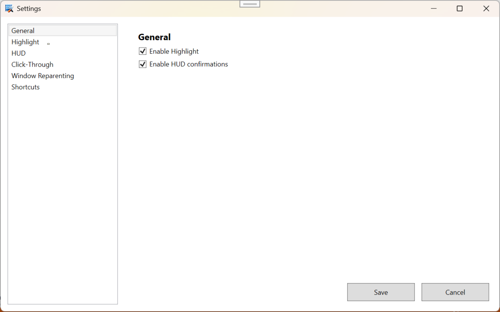
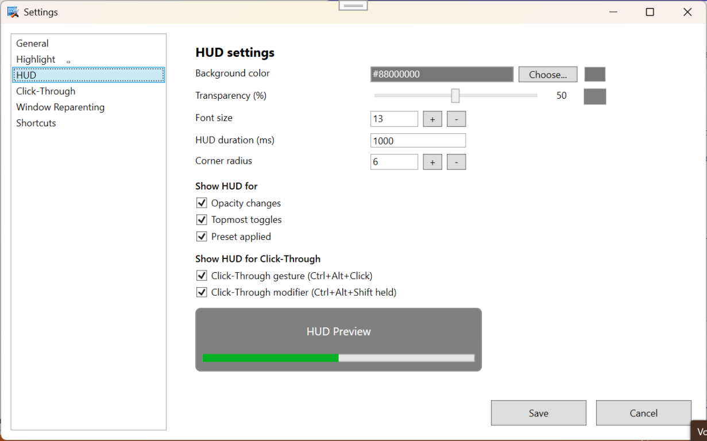
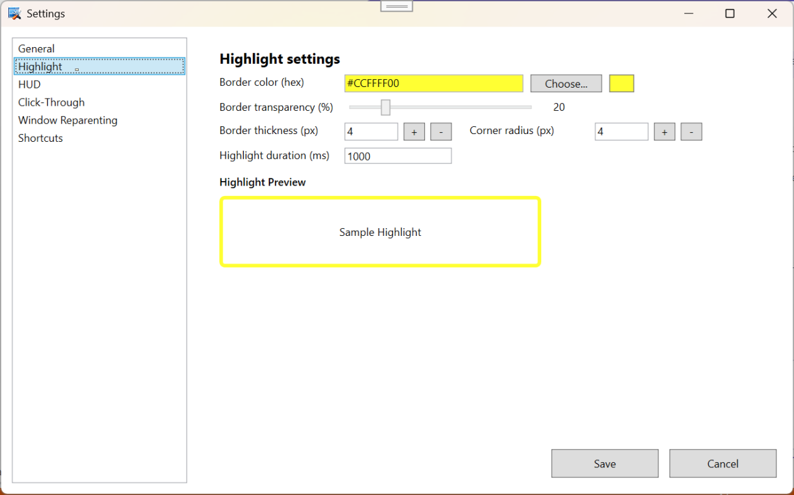
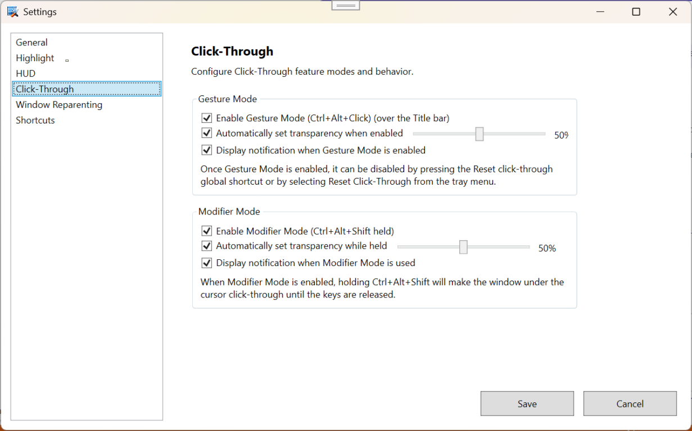
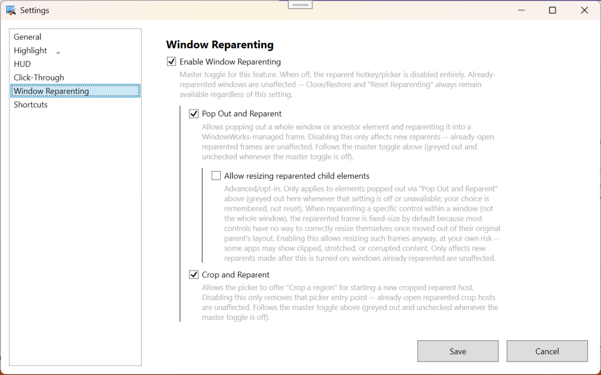
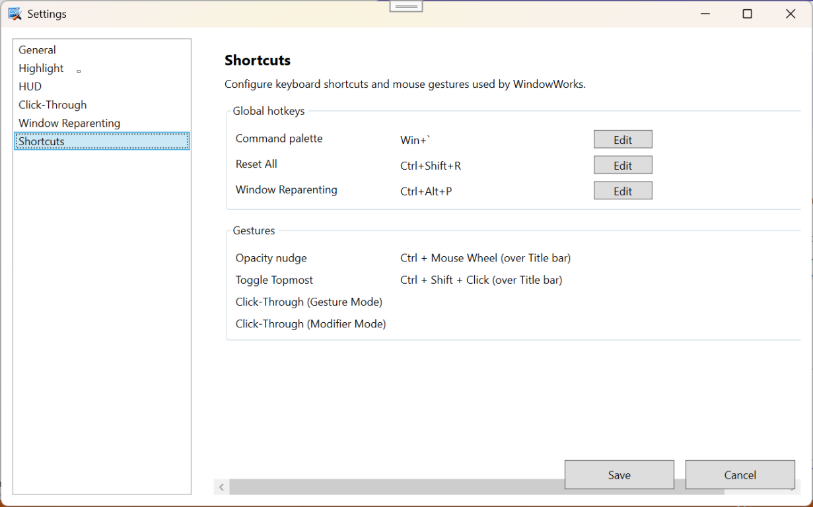

# WindowWorks

WindowWorks is a lightweight, tray-first Windows utility for quick window-level transformations
(opacity, topmost, click-through) and for popping windows (or a cropped region of one) out into
independently movable/resizable floating hosts — all with minimal friction and no admin rights.

## Requirements

- Windows 10/11
- .NET 10 SDK (Windows Desktop workload)
- Visual Studio Professional 2026 (recommended) or the `dotnet` CLI

## Build / Run

From the repository root:

1. Build:

   ```
   dotnet build WindowWorks/src/WindowWorks.App/WindowWorks.App.csproj
   ```

2. Run:

   ```
   dotnet run --project WindowWorks/src/WindowWorks.App/WindowWorks.App.csproj
   ```

Visual Studio (recommended for development):

- Open `WindowWorks/WindowWorks.sln` in Visual Studio Professional 2026.
- Set `WindowWorks.App` as the startup project.
- Press F5 (Start Debugging) or Ctrl+F5 (Start Without Debugging) to run.

## Features

- Tray-only app with a NotifyIcon and a compact context menu.
- Global hotkeys (all configurable in Settings -> Shortcuts): Win+\` opens the command palette
  placeholder; Ctrl+Alt+R triggers Emergency Reset; Ctrl+Alt+P triggers Window Reparenting.
- Mouse gestures: Ctrl+MouseWheel adjusts opacity; Ctrl+Shift+Click toggles topmost; Ctrl+Alt+Click
  toggles click-through.
- Transient HUD shown after actions, with an Undo button that reverts the last change.
- Presets load from an embedded JSON seed and can be applied to the active window.
- Emergency Reset restores all windows modified by WindowWorks.
- No admin required; no code injection into other processes.

### Window Reparenting

Pops a picked window (or a cropped region of one) out of its original parent and re-hosts it in a
lightweight floating WindowWorks host window, so it can be moved, resized, or kept on top
independently of its original app.

- Two independent modes, toggled in Settings -> Window Reparenting:
  - **Pop Out and Reparent** - pick a whole window (or an ancestor in its window chain) via the
    window picker.
  - **Crop and Reparent** - drag-select a rectangular region of a window instead of taking the
    whole thing; the resulting host is fixed-size (drag-repositionable, not resizable).
- **Allow resizing reparented child elements** makes whole-window (non-crop) reparented hosts
  resizable via a thin edge grip band. This only affects windows reparented after the setting is
  changed, not already-open ones.
- The reparented host shows a small floating overlay (minimize/maximize/close/reopen-original) on
  hover near the top of the window.
- The Window Reparenting hotkey is editable in Settings -> Shortcuts, alongside Command Palette
  and Emergency Reset.
- Escape cancels an in-progress pick or crop-region selection at any time.

## Settings Highlights



- HUD and Highlight colors support embedded alpha (`#AARRGGBB`); the legacy percent-based
  transparency sliders (`HudTransparencyPercent`, `HighlightBorderTransparencyPercent`) are still
  saved alongside the new format for backward compatibility.
- Settings window content aligns top-left; individual pages update their previews on load via
  deferred initialization to avoid timing issues.
- Shortcuts settings use an MVVM `ShortcutsSettingsViewModel`; some other settings pages still use
  code-behind for dialog interactions and immediate UI previews (in-progress MVVM migration).

| HUD | Highlight | Click-Through |
|---|---|---|
|  |  |  |

| Window Reparenting | Shortcuts |
|---|---|
|  |  |


## QA Checklist

- Open Settings -> HUD and verify the background color and transparency slider update the
  embedded preview.
- Open Settings -> Highlight and verify the border color, transparency slider, and thickness
  update the preview.
- Save settings and confirm the saved JSON contains both the `#AARRGGBB` color value and the
  corresponding transparency-percent keys for HUD and Highlight.
- Reparent a whole window and a cropped region; verify resize (when enabled), the hover overlay,
  and Escape-cancel during picking/cropping.
- Edit each of the three configurable hotkeys individually in Settings -> Shortcuts and confirm
  Save applies immediately without affecting the other two.

## Files of Interest

- `WindowWorks/src/WindowWorks.App/*` - main app code (`ReparentController`, `ReparentEngine`,
  `HotkeyManager`, `WindowPickerSession`).
- `WindowWorks/src/WindowWorks.App.UI/*` - WPF UI controls and settings pages
  (`ReparentHostWindow`, `CropRectSelectionWindow`, `WindowReparentingSettingsControl`,
  `ShortcutsSettingsControl`).
- `WindowWorks/src/WindowWorks.App.UI/ViewModels/*` - ViewModel(s) used for the ongoing MVVM
  migration (e.g. `ShortcutsSettingsViewModel`).
- `WindowWorks/SeedData/default_presets.json` - seed presets.
- `WindowWorks/SeedData/presets.schema.json` - JSON schema for presets.

## Notes

This repository is actively being migrated toward MVVM; some controls still use code-behind for
dialog interactions and immediate UI previews. Colors/transparency are currently persisted in both
the new (`#AARRGGBB`) and legacy (percent) formats for backward compatibility; consolidating to a
single format is a possible future follow-up.
