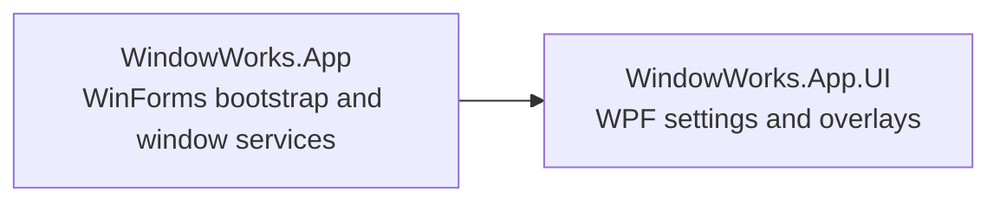

# Code Summary

WindowWorks is a .NET 10 Windows desktop utility for managing window behavior through a WinForms tray application and WPF settings/overlay UI.

| Symbol | File | Responsibility |
| --- | --- | --- |
| `Program` / `TrayApplicationContext` | `WindowWorks/src/WindowWorks.App/Program.cs` | Composes application services and runs the tray lifetime. |
| `WindowManager` | `WindowWorks/src/WindowWorks.App/WindowManager.cs` | Controls tracked window state and behavior. |
| `HotkeyManager` | `WindowWorks/src/WindowWorks.App/HotkeyManager.cs` | Registers and dispatches global shortcuts. |
| `Persistence` | `WindowWorks/src/WindowWorks.App/Persistence.cs` | Persists application settings and presets. |
| `WpfApp` / `AppServices` | `WindowWorks/src/WindowWorks.App.UI/App.xaml.cs`, `AppServices.cs` | Hosts WPF UI services for the WinForms-hosted application. |
| `SettingsWindow` | `WindowWorks/src/WindowWorks.App.UI/SettingsWindow.xaml.cs` | Hosts settings sections and user configuration. |
| Settings view models | `WindowWorks/src/WindowWorks.App.UI/ViewModels/` | Bind general, highlight, HUD, shortcut, and click-through settings. |

See `docs/KEY_FLOWS.md` for traced end-to-end call flows.
